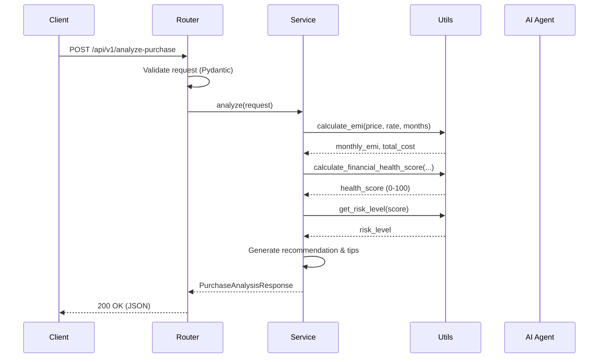

# 🏗 Architecture Overview

> Deep-dive into FinPilot AI's system design, module layout, and architectural decisions.

**Related Docs:** [API Documentation](./api_docs.md) · [Roadmap](./roadmap.md) · [Backend README](../backend/README.md)

---

## 📐 System Overview

FinPilot AI follows a **layered, modular architecture** designed for incremental complexity — starting with rule-based financial engines and scaling toward multi-agent AI orchestration.

```
┌─────────────────────────────────────────────────────────────────────┐
│                        CLIENT LAYER                                 │
│         React / Next.js Dashboard  ·  Mobile App  ·  CLI           │
└──────────────────────────┬──────────────────────────────────────────┘
                           │  HTTP / WebSocket
                           ▼
┌─────────────────────────────────────────────────────────────────────┐
│                      API GATEWAY (FastAPI)                           │
│   ┌───────────┐  ┌──────────────┐  ┌────────────┐  ┌────────────┐ │
│   │   CORS    │  │ Rate Limiter │  │   Auth     │  │  Logging   │ │
│   │Middleware │  │  Middleware   │  │ Middleware │  │ Middleware │ │
│   └───────────┘  └──────────────┘  └────────────┘  └────────────┘ │
└──────────────────────────┬──────────────────────────────────────────┘
                           │  Validated Pydantic Models
                           ▼
┌─────────────────────────────────────────────────────────────────────┐
│                      SERVICE LAYER                                   │
│   ┌──────────────────┐  ┌──────────────────┐  ┌─────────────────┐  │
│   │ Purchase Service │  │  Budget Service  │  │  Goal Service   │  │
│   │ (EMI vs Full Pay)│  │  (Coming Soon)   │  │  (Coming Soon)  │  │
│   └────────┬─────────┘  └──────────────────┘  └─────────────────┘  │
│            │                                                        │
│            ▼                                                        │
│   ┌──────────────────────────────────────────────────────┐         │
│   │              UTILS LAYER                              │         │
│   │  financial.py · formatting.py · validators.py         │         │
│   └──────────────────────────────────────────────────────┘         │
└──────────────────────────┬──────────────────────────────────────────┘
                           │
                           ▼
┌─────────────────────────────────────────────────────────────────────┐
│                     AI AGENTS LAYER                                  │
│   ┌──────────────┐ ┌──────────────┐ ┌────────┐ ┌───────────────┐  │
│   │ EMI Decision │ │    Budget    │ │  Risk  │ │     Goal      │  │
│   │    Agent     │ │    Agent     │ │ Agent  │ │     Agent     │  │
│   └──────┬───────┘ └──────────────┘ └────────┘ └───────────────┘  │
│          │  LLM Calls (future)                                      │
│          ▼                                                          │
│   ┌──────────────────────────────────────────────────────┐         │
│   │         LLM Provider (OpenAI / LangChain)            │         │
│   └──────────────────────────────────────────────────────┘         │
└──────────────────────────┬──────────────────────────────────────────┘
                           │
                           ▼
┌─────────────────────────────────────────────────────────────────────┐
│                     DATA LAYER                                       │
│   ┌──────────────┐  ┌──────────────┐  ┌────────────────────────┐  │
│   │  PostgreSQL  │  │    Redis     │  │   File Storage (S3)    │  │
│   │  (Primary)   │  │   (Cache)    │  │   (Reports / Exports)  │  │
│   └──────────────┘  └──────────────┘  └────────────────────────┘  │
└─────────────────────────────────────────────────────────────────────┘
```

---

## 🛠 Technology Stack

| Category | Technology | Purpose | Status |
|---|---|---|---|
| **Language** | Python 3.10+ | Core backend language | ✅ Active |
| **Framework** | FastAPI | Async web framework with auto-docs | ✅ Active |
| **Validation** | Pydantic v2 | Request/response schema validation | ✅ Active |
| **Server** | Uvicorn | High-performance ASGI server | ✅ Active |
| **Config** | python-dotenv | Environment variable management | ✅ Active |
| **Database** | PostgreSQL 16 | Primary data store | 🔜 Planned |
| **Cache** | Redis | Session cache & rate limiting | 🔜 Planned |
| **Auth** | JWT (PyJWT) | Token-based authentication | 🔜 Planned |
| **AI/LLM** | OpenAI / LangChain | Intelligent financial analysis | 🔜 Planned |
| **Frontend** | Next.js / React | User dashboard | 🔜 Planned |
| **Container** | Docker & Docker Compose | Development & deployment | 🔜 Planned |

---

## 📦 Module Descriptions

### `app/routes/` — API Route Handlers

**Philosophy:** Thin controllers that do zero business logic.

Routes are responsible for:
- Receiving and parsing HTTP requests
- Delegating to the appropriate service
- Returning formatted HTTP responses

```python
# Example: routes/purchase_analysis.py
@router.post("/analyze-purchase")
async def analyze_purchase(request: PurchaseAnalysisRequest):
    result = purchase_service.analyze(request)  # Delegate to service
    return result                                # Return response
```

| File | Endpoint | Method |
|---|---|---|
| `health.py` | `/health` | GET |
| `purchase_analysis.py` | `/api/v1/analyze-purchase` | POST |

---

### `app/services/` — Business Logic Layer

**Philosophy:** Pure domain logic, no framework dependencies.

Services orchestrate the core business rules by combining utility functions with domain-specific decision logic.

| File | Responsibility |
|---|---|
| `purchase_service.py` | EMI vs Full Payment decision engine — calculates financial metrics, determines recommendations, generates personalized tips |

---

### `app/models/` — Pydantic Schemas

**Philosophy:** Single source of truth for data shapes.

All request and response models are defined using Pydantic, providing:
- Automatic validation with descriptive error messages
- JSON serialization/deserialization
- OpenAPI schema generation for Swagger UI

| File | Models |
|---|---|
| `purchase.py` | `PurchaseAnalysisRequest`, `PurchaseAnalysisResponse`, `FinancialBreakdown` |

---

### `app/utils/` — Utility Functions

**Philosophy:** Small, pure, reusable functions with no side effects.

| File | Functions |
|---|---|
| `financial.py` | `calculate_emi()` — EMI calculation using reducing balance formula |
| | `calculate_financial_health_score()` — 0–100 composite health score |
| | `get_risk_level()` — Risk classification (Low / Medium / High) |

---

### `app/ai_agents/` — AI Agent Templates

**Philosophy:** Dependency injection for LLM clients; fallback to rule-based logic.

Each agent follows a consistent pattern:
1. Accept an optional LLM client via constructor
2. Expose async methods for AI-powered analysis
3. Fall back to deterministic logic when no LLM is available

| File | Agent | Status |
|---|---|---|
| `emi_decision_agent.py` | EMI Decision Agent | ✅ Starter |
| `budget_agent.py` | Budget Analysis Agent | 🔜 Template |
| `risk_agent.py` | Risk Assessment Agent | 🔜 Template |
| `goal_agent.py` | Goal Planning Agent | 🔜 Template |

---

## 🔄 Data Flow

The following diagram illustrates a typical request lifecycle through the system:



### Key Design Decisions

1. **Routes never call Utils directly** — All logic flows through Services
2. **Services are framework-agnostic** — Can be tested without FastAPI
3. **Utils are pure functions** — No state, no side effects, easily testable
4. **AI Agents are optional** — System works fully without LLM integration

---

## 🤖 Multi-Agent Architecture

FinPilot AI is designed to evolve into a **multi-agent system** where specialized AI agents collaborate to provide comprehensive financial guidance.

```
                    ┌──────────────────────┐
                    │   Orchestrator Agent  │
                    │   (Future)            │
                    └──────────┬───────────┘
                               │
            ┌──────────────────┼──────────────────┐
            │                  │                   │
            ▼                  ▼                   ▼
   ┌─────────────────┐ ┌────────────────┐ ┌──────────────────┐
   │  EMI Decision   │ │    Budget      │ │      Risk        │
   │     Agent       │ │    Agent       │ │     Agent        │
   │                 │ │                │ │                  │
   │ "Should I buy   │ │ "How is my     │ │ "What's my risk  │
   │  on EMI or pay  │ │  spending?"    │ │  exposure?"      │
   │  in full?"      │ │                │ │                  │
   └─────────────────┘ └────────────────┘ └──────────────────┘
                                                    │
                                          ┌─────────┘
                                          ▼
                                  ┌──────────────────┐
                                  │    Goal Agent     │
                                  │                   │
                                  │ "Am I on track    │
                                  │  for my goals?"   │
                                  └──────────────────┘
```

### Agent Communication Pattern (Planned)

```python
# Future: Orchestrator coordinates multiple agents
class OrchestratorAgent:
    async def comprehensive_analysis(self, user_profile):
        # Run agents concurrently
        emi_result, budget_result, risk_result = await asyncio.gather(
            self.emi_agent.analyze(user_profile),
            self.budget_agent.analyze(user_profile),
            self.risk_agent.assess(user_profile),
        )
        # Synthesize into unified recommendation
        return self.synthesize(emi_result, budget_result, risk_result)
```

---

## 🧩 API Layer Design

FinPilot AI follows a strict **three-tier API pattern**:

```
Request → Route (Controller) → Service → Utils
                                  ↓
                              AI Agent (optional)
```

### Layer Responsibilities

| Layer | Does | Does NOT |
|---|---|---|
| **Route** | Parse request, validate input, return response | Contain business logic |
| **Service** | Orchestrate business rules, combine utils | Access HTTP request/response objects |
| **Utils** | Perform atomic calculations | Know about business context |
| **AI Agent** | Provide LLM-enhanced analysis | Replace rule-based fallbacks |

### Why This Matters

- **Testability:** Services and utils can be unit-tested without spinning up a server
- **Reusability:** Utils can be shared across multiple services
- **Flexibility:** Swapping frameworks (FastAPI → Django) only affects the Routes layer
- **AI-Ready:** Agents can be injected into services without changing the API contract

---

## 🚀 Future Scaling Considerations

### Horizontal Scaling

```
                    ┌────────────────┐
                    │  Load Balancer │
                    │   (nginx)      │
                    └───────┬────────┘
                            │
              ┌─────────────┼─────────────┐
              ▼             ▼             ▼
        ┌──────────┐  ┌──────────┐  ┌──────────┐
        │ FastAPI  │  │ FastAPI  │  │ FastAPI  │
        │Instance 1│  │Instance 2│  │Instance 3│
        └────┬─────┘  └────┬─────┘  └────┬─────┘
             │              │              │
             └──────────────┼──────────────┘
                            ▼
                    ┌──────────────┐
                    │  PostgreSQL  │
                    │  (Primary)   │
                    └──────────────┘
```

### Planned Infrastructure

| Component | Technology | Purpose |
|---|---|---|
| Container Orchestration | Docker Compose → Kubernetes | Service management |
| CI/CD | GitHub Actions | Automated testing & deployment |
| Monitoring | Prometheus + Grafana | Performance metrics |
| Logging | Structured JSON logs | Centralized log aggregation |
| API Gateway | nginx / Traefik | Load balancing, SSL termination |
| Message Queue | Redis / RabbitMQ | Async agent communication |

### Performance Targets

| Metric | Target |
|---|---|
| API Response Time (p95) | < 200ms (rule-based), < 2s (LLM-enhanced) |
| Concurrent Users | 1,000+ |
| Uptime SLA | 99.9% |
| Database Query Time (p95) | < 50ms |

---

## 📎 Related Documentation

- [API Documentation](./api_docs.md) — Endpoint reference and examples
- [Project Roadmap](./roadmap.md) — Development timeline and milestones
- [Backend README](../backend/README.md) — Quick start guide
- [Root README](../README.md) — Project overview

---

*Last updated: May 2026*
