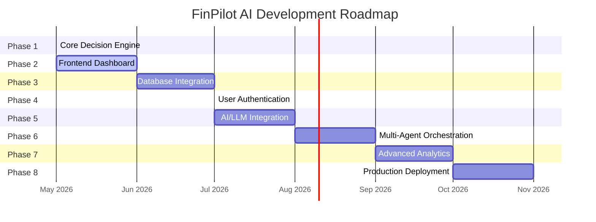

# 🗺 Project Roadmap

> FinPilot AI development timeline — from core engine to production deployment.

**Related Docs:** [Architecture](./architecture.md) · [API Documentation](./api_docs.md) · [Backend README](../backend/README.md)

---

## Overview

---

## Phase 1: Core Decision Engine ✅ DONE

> **Goal:** Build the foundational EMI vs Full Payment analysis engine with a clean API.

- [x] Project scaffolding and monorepo structure
- [x] FastAPI application setup with Uvicorn
- [x] Environment configuration with `.env` and `python-dotenv`
- [x] Pydantic models for request/response validation
- [x] EMI calculation utility (reducing balance formula)
- [x] Financial health scoring algorithm (0–100 scale)
- [x] Risk level classification (Low / Medium / High)
- [x] Purchase analysis service layer
- [x] `POST /api/v1/analyze-purchase` endpoint
- [x] `GET /health` endpoint
- [x] CORS middleware for frontend integration
- [x] Auto-generated API docs (Swagger UI + ReDoc)
- [x] AI agent starter templates (EMI, Budget, Risk, Goal)
- [x] Comprehensive README with examples
- [x] Project documentation (Architecture, API docs, Roadmap)

**Deliverables:** Fully functional backend API with purchase analysis capabilities.

---

## Phase 2: Frontend Dashboard 🔄 IN PROGRESS

> **Goal:** Build an interactive dashboard for users to visualize their financial analysis.

- [ ] Initialize Next.js / React project in `frontend/` directory
- [ ] Design system setup (colors, typography, spacing tokens)
- [ ] Landing page with product overview
- [ ] Purchase analysis form with real-time validation
- [ ] Results dashboard with recommendation display
- [ ] Financial health score visualization (gauge / progress bar)
- [ ] Financial breakdown charts (pie chart, bar chart)
- [ ] Risk level indicator with color coding
- [ ] Actionable tips display cards
- [ ] Responsive design (mobile, tablet, desktop)
- [ ] Dark mode support
- [ ] API integration with backend endpoints
- [ ] Loading states and error handling
- [ ] SEO optimization and meta tags

**Deliverables:** A responsive, visually polished frontend that connects to the backend API.

---

## Phase 3: Database Integration 📋 PLANNED

> **Goal:** Persist user data and analysis history for long-term tracking.

- [ ] Set up PostgreSQL 16 with Docker
- [ ] Design database schema (users, analyses, financial_profiles)
- [ ] Integrate SQLAlchemy or Tortoise ORM
- [ ] Create database migration system (Alembic)
- [ ] Implement CRUD operations for financial profiles
- [ ] Save analysis results with timestamps
- [ ] Add analysis history endpoint (`GET /api/v1/analyses`)
- [ ] Implement data pagination and filtering
- [ ] Add database health check to `/health` endpoint
- [ ] Seed database with sample data
- [ ] Database backup strategy documentation

**Deliverables:** Persistent storage with full CRUD for user financial data.

---

## Phase 4: User Authentication 📋 PLANNED

> **Goal:** Secure the API with user accounts and JWT-based authentication.

- [ ] User registration endpoint (`POST /api/v1/auth/register`)
- [ ] User login endpoint (`POST /api/v1/auth/login`)
- [ ] JWT token generation and validation
- [ ] Password hashing with bcrypt
- [ ] Protected route middleware
- [ ] Token refresh mechanism
- [ ] User profile endpoints (GET, PUT)
- [ ] Email verification flow (optional)
- [ ] Password reset flow
- [ ] Rate limiting per user
- [ ] Frontend authentication integration (login/register pages)
- [ ] Session management on frontend

**Deliverables:** Secure authentication system with JWT tokens and user management.

---

## Phase 5: AI/LLM Integration 📋 PLANNED

> **Goal:** Enhance financial analysis with AI-powered insights using LLMs.

- [ ] OpenAI API integration setup
- [ ] LangChain framework integration
- [ ] EMI Decision Agent — LLM-enhanced analysis
- [ ] Conversational financial advice endpoint
- [ ] Prompt engineering for financial domain
- [ ] Response streaming for real-time AI output
- [ ] Token usage tracking and cost management
- [ ] Fallback to rule-based logic on LLM failure
- [ ] Caching LLM responses for common queries
- [ ] A/B testing: rule-based vs LLM recommendations
- [ ] Financial domain fine-tuning research

**Deliverables:** AI-powered financial analysis with intelligent, context-aware recommendations.

---

## Phase 6: Multi-Agent Orchestration 📋 PLANNED

> **Goal:** Build a collaborative multi-agent system for comprehensive financial planning.

- [ ] Orchestrator Agent — coordinates sub-agents
- [ ] Budget Analysis Agent — spending analysis and optimization
- [ ] Risk Assessment Agent — multi-dimensional risk scoring
- [ ] Goal Planning Agent — financial goal tracking and projections
- [ ] Agent communication protocol (message passing)
- [ ] Concurrent agent execution with `asyncio.gather`
- [ ] Result synthesis and conflict resolution
- [ ] `POST /api/v1/comprehensive-analysis` endpoint
- [ ] Agent health monitoring and failover
- [ ] Agent performance metrics and logging
- [ ] Inter-agent dependency graph visualization

**Deliverables:** Multi-agent system providing holistic financial analysis from multiple perspectives.

---

## Phase 7: Advanced Analytics 📋 PLANNED

> **Goal:** Add sophisticated analytics, reporting, and personalization features.

- [ ] Spending pattern analysis over time
- [ ] Budget optimization recommendations
- [ ] Investment recommendation engine
- [ ] Financial goal progress tracking
- [ ] Comparative analysis (benchmark against peers)
- [ ] PDF/Excel report generation
- [ ] Email notification system (alerts, reports)
- [ ] Dashboard analytics (charts, trends, forecasts)
- [ ] Custom financial scenarios ("what-if" analysis)
- [ ] Savings projection calculator
- [ ] Debt payoff strategy optimizer

**Deliverables:** Rich analytics suite with reporting, projections, and personalized insights.

---

## Phase 8: Production Deployment 📋 PLANNED

> **Goal:** Deploy FinPilot AI to production with CI/CD, monitoring, and scalability.

- [ ] Docker Compose production configuration
- [ ] CI/CD pipeline with GitHub Actions
- [ ] Automated testing (unit, integration, e2e)
- [ ] Cloud deployment (AWS / GCP / Vercel)
- [ ] SSL/TLS certificate setup
- [ ] Domain configuration (finpilot.ai)
- [ ] Environment-specific configurations (staging, production)
- [ ] Monitoring with Prometheus + Grafana
- [ ] Centralized logging (ELK stack or similar)
- [ ] Error tracking (Sentry)
- [ ] Auto-scaling configuration
- [ ] Database backups (automated, daily)
- [ ] Security audit and penetration testing
- [ ] Performance load testing
- [ ] User documentation and onboarding guide
- [ ] Launch! 🚀

**Deliverables:** Production-ready deployment with monitoring, CI/CD, and scalability.

---

## 📊 Progress Summary

| Phase | Status | Progress |
|---|---|---|
| Phase 1 — Core Decision Engine | ✅ Done | █████████████████████ 100% |
| Phase 2 — Frontend Dashboard | 🔄 In Progress | ██░░░░░░░░░░░░░░░░░░░ 10% |
| Phase 3 — Database Integration | 📋 Planned | ░░░░░░░░░░░░░░░░░░░░░ 0% |
| Phase 4 — User Authentication | 📋 Planned | ░░░░░░░░░░░░░░░░░░░░░ 0% |
| Phase 5 — AI/LLM Integration | 📋 Planned | ░░░░░░░░░░░░░░░░░░░░░ 0% |
| Phase 6 — Multi-Agent Orchestration | 📋 Planned | ░░░░░░░░░░░░░░░░░░░░░ 0% |
| Phase 7 — Advanced Analytics | 📋 Planned | ░░░░░░░░░░░░░░░░░░░░░ 0% |
| Phase 8 — Production Deployment | 📋 Planned | ░░░░░░░░░░░░░░░░░░░░░ 0% |

---

## 📎 Related Documentation

- [Architecture Overview](./architecture.md) — System design deep-dive
- [API Documentation](./api_docs.md) — Endpoint reference and examples
- [Backend README](../backend/README.md) — Quick start guide

---

*Last updated: May 2026*
